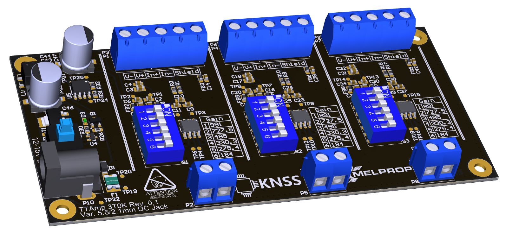

# TTAmp
> Differential amplifier board developed for KNN Melprop

A multi channel instrumentation amplifier board designed to work with tensometers in bridge circuit. Supply voltage ranges from 12 to 15V, variable gain set by on-board 6-position dipswitch, independently for all channels.
The board is intended to be used for developement and measurement of jet engines.

## Meta

  
Koło Naukowe Systemów Scalonych  
Krzysztof Belewicz – belewicz@gmail.com  
Distributed under the Beerware license.  
  
[https://github.com/CannaCardo/github-link](https://github.com/CannaCardo/)

